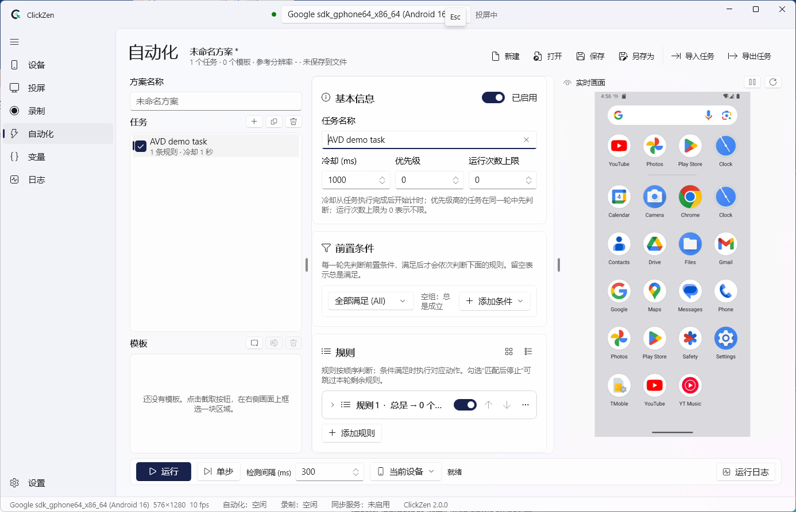
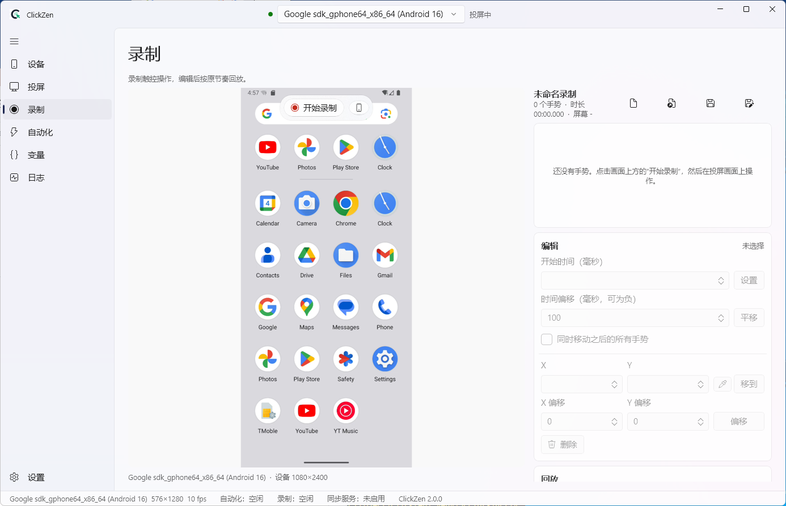
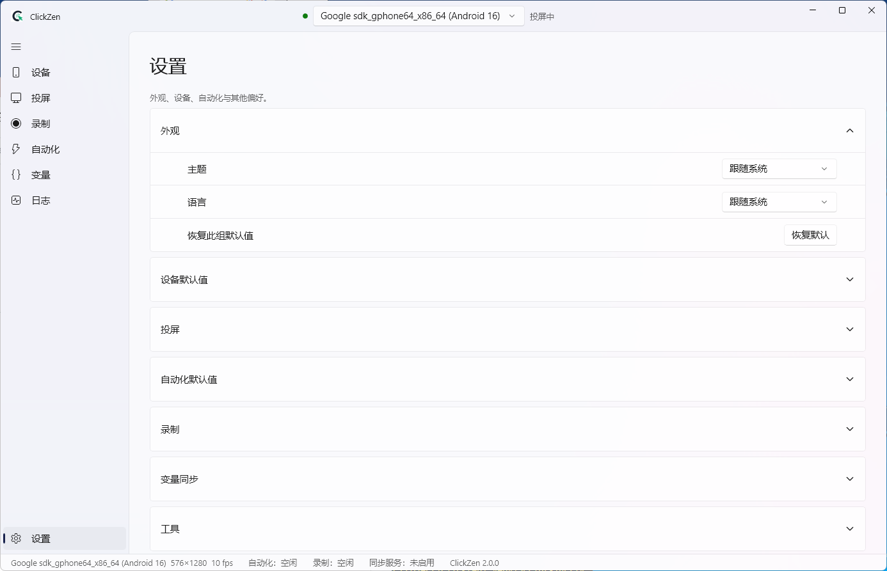

<p align="center">
  
</p>

# ClickZen 2

基于 ADB 与 scrcpy 的 Android 自动化控制工具：应用内投屏、触控录制回放、图像识别自动化、变量与网络同步，支持真机、无线设备和主流模拟器。

> 2.0 版本使用 C# / WinUI 3 完全重写，现已取代旧 Python 版成为主线。**不兼容 1.x 的配置、方案和录制格式**，请保留旧数据备份。旧版仅保留在历史标签与历史 Release 中，不再作为主线维护。

需要 Windows 桌面自动化？试试 [ClickYen](https://github.com/Exmeaning/ClickYen)。

---

## 主要功能

- **应用内投屏**：内置 scrcpy-server 协议客户端与 FFmpeg 解码，毫秒级触控注入，支持多指与连续滑动。
- **多设备**：同时连接多台真机/模拟器，每台设备独立运行自动化方案，变量可跨设备共享。
- **录制与回放**：在投屏画面上直接操作即可录制，保存完整轨迹，按原节奏或变速回放。
- **图像识别自动化**：方案 → 任务 → 规则（条件组 + 动作），支持模板匹配、颜色、变量表达式，可点击匹配到的位置。
- **模拟器窗口模式**：直接捕获模拟器窗口画面（支持后台和被遮挡窗口）。
- **变量网络同步**：TCP 服务，让外部程序或其他实例读写自动化变量。
- **深色/浅色主题、中英双语界面**。

## 系统要求

- Windows 10 1809（17763）或更高版本，x64
- Android 5.0+ 设备，开启 USB 调试（小米需额外开启「USB 调试（安全设置）」）

## 下载

前往 [Releases](https://github.com/Exmeaning/ClickZen/releases)：

- `ClickZen-<版本>-win-x64.zip`：解压即用，启动最快（推荐）。
- `ClickZen-<版本>-win-x64.exe`：单文件版。

adb、scrcpy-server 和 FFmpeg 均已随程序附带，无需另外安装。

## 快速上手

1. 启动 ClickZen，连接 USB 或无线 Android 设备。
2. 在「投屏」页确认画面；模拟器也可在设备页绑定为窗口模式。
3. 在「录制」页操作并保存 `.czrec`，或在「自动化」页创建方案并运行。
4. 变量页可以启用变量同步服务；协议与示例见 [变量同步协议](docs/variable-sync-protocol.md)。

## 界面预览

### 自动化工作台



### 录制与回放



### 设置




### 模拟器窗口模式

在设备页选择「绑定模拟器窗口」，选择窗口并裁剪 Android 画面，关联 ADB 设备（可选），确认参考分辨率后保存档案。窗口画面采用 Windows.Graphics.Capture / PrintWindow 捕获；通过关联 ADB 可以使用 scrcpy、adb 或 Root 输入。没有关联 ADB 时使用窗口输入，受模拟器自身后台输入能力限制。档案会记住窗口匹配规则与裁剪范围。

### 变量同步

变量页管理变量声明、实时值、同步方向以及 TCP 服务端。设置端口并生成访问令牌，按需配置防火墙；令牌以 Windows DPAPI 加密保存。该协议不提供 TLS，不应直接暴露到公网。客户端示例、握手与消息格式见 [变量同步协议](docs/variable-sync-protocol.md)。

## 从源码构建

前置条件：

- [.NET 10 SDK](https://dotnet.microsoft.com/download)
- Windows SDK 10.0.19041 或更高（或安装 Visual Studio 的「WinUI 应用程序开发」工作负载）

```bash
git clone https://github.com/Exmeaning/ClickZen.git
cd ClickZen
dotnet build ClickZen.slnx -c Release          # 首次构建会下载并校验 scrcpy 4.1 发布包
dotnet test --solution ClickZen.slnx -c Release
dotnet run --project src/ClickZen.App -c Release
```

冒烟测试（逐页导航、切换主题后自动退出，退出码 0 表示通过）：

```powershell
$env:CLICKZEN_DATA_DIR = "$env:TEMP\cz-smoke"
& src\ClickZen.App\bin\Release\net10.0-windows10.0.19041.0\win-x64\ClickZen.exe --smoke --lang en-US
```

`--lang zh-CN` / `--lang en-US` 临时覆盖本次启动语言，不改用户设置。`--page mirror` 可直接导航到页面。冒烟不联网、不启动 ADB。

设备自检参数：`--selftest-input`、`--selftest-recording`、`--selftest-automation`、`--selftest-window`、`--selftest-variables`。前四项需要在线 Android 设备或 Android Emulator；窗口自检需要可捕获的模拟器窗口。每次自检应指定全新的 `CLICKZEN_DATA_DIR`；通过退出 0，失败非零。自检不会检查更新。

快捷键：F9 录制/停止，F10 回放/停止（录制页）；F5 运行/停止（自动化页）；Ctrl+S 保存、Ctrl+O 打开当前文档；Ctrl+Shift+S 保存当前设备截图；Ctrl+, 打开设置。设置即时保存，语言需重启，设备/自动化默认值用于下一次连接或新建方案。

### 项目结构

```
src/
  ClickZen.Core/      领域模型与纯逻辑（坐标、手势、自动化引擎、变量、序列化），不依赖 Windows
  ClickZen.Device/    ADB、scrcpy 协议、视频解码、输入注入、设备会话
  ClickZen.Platform/  Win32/WinRT：窗口枚举与窗口捕获
  ClickZen.App/       WinUI 3 界面
tests/                xUnit v3 测试
build/                构建脚本（第三方组件下载与校验）
```

### 升级 scrcpy

scrcpy 客户端与 server 的协议必须版本一致。升级时需同时修改：

1. `build/ThirdParty.targets` 中的版本号与 SHA-256；
2. `src/ClickZen.Device/Scrcpy/ScrcpyServerInfo.cs` 中的 `Version`；
3. 对照新版 `doc/develop.md` 与 `app/src/control_msg.c` 检查协议变更。

### 界面文字

界面字符串维护在 `src/ClickZen.App/Strings/strings.tsv`（中英对照），修改后运行：

```bash
python src/ClickZen.App/Strings/gen_resw.py
```

测试会检查中英文键集合一致、所有 `x:Uid` 都有对应资源。

## 数据位置

| 内容 | 位置 |
|---|---|
| 设置、设备、模拟器档案、日志、崩溃报告 | `%LocalAppData%\ClickZen\` |
| 方案（`.czscheme`）、录制（`.czrec`）、截图 | `文档\ClickZen\` |

## 开源协议

AGPL-3.0，见 [LICENSE](LICENSE)。第三方组件见 [THIRD-PARTY-NOTICES.md](THIRD-PARTY-NOTICES.md)。

## 致谢

- [scrcpy](https://github.com/Genymobile/scrcpy)
- [AdvancedSharpAdbClient](https://github.com/SharpAdb/AdvancedSharpAdbClient)
- [Klick'r](https://github.com/Nain57/Smart-AutoClicker)：自动化功能的主要参考
- [FFmpeg](https://ffmpeg.org/)、[OpenCV](https://opencv.org/) / [OpenCvSharp](https://github.com/shimat/opencvsharp)

## 免责声明

本软件不提供任何形式的保证，请合理合法使用。

联系：[GitHub Issues](https://github.com/Exmeaning/ClickZen/issues) · exmeaning@foxmail.com
